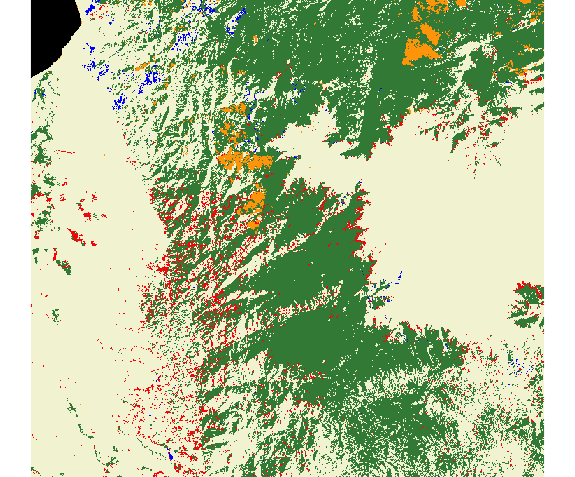
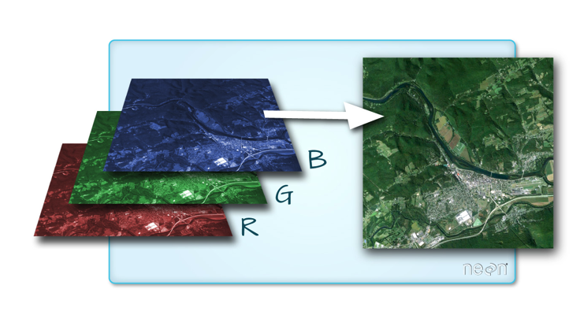

```{r setup, include=FALSE}
# load packages
library(pacman)
pacman::p_load(here,knitr,tidyverse,sf,sp,raster,viridis,rgdal,leaflet)

# option html
options(htmltools.preserve.raw = FALSE)
options(htmltools.dir.version = F)
opts_chunk$set(fig.align="center", fig.height=4 , dpi=300 , cache=F)
```

name: contenido
# Ya vimos..

- [Operaciones geométricas con objetos sf](https://github.com/taller-R/clase-12)

--

# Hoy veremos 

1. [Introducción a datos raster](#intro)

2. [Importar datos raster](#read)

3. [Operaciones geométricas con raster](#ope)

4. [Raster de varios layers](#layers)

<!------------------------------->
<!--- Introducción a datos raster --->
<!------------------------------->
---
class: inverse, center, middle
name: intro
# [1. Introducción a datos raster](#contenido)

<html><div style='float:left'></div><hr color='#FF007F' size=1px width=796px></html>

---
# 1.1. Qué es un raster?

- Un raster es una matriz de celdas (o píxeles) organizadas en filas y columnas (o una cuadrícula) en la que cada celda contiene un valor que representa información. 

<div align="center">

</div>
Tomado de: [https://www.neonscience.org](https://www.neonscience.org/resources/learning-hub/tutorials/dc-raster-data-r)

---
# 1.2. Elementos de un raster

* Dimensión o numero de filas y columnas, así como el numero de bandas que tiene el raster

* La resolución de cada pixel 

* Tipo de archivo

* CRS

* Información dentro de los pixelex 

# 1.3. Extenciones de un raster

* .tif

* .nc

* .nc4

---
# 1.4. Algunas fuentes de información de datos raster


- **Luces nocturnas mensuales 2012-2019**

Pueden descargarse en [https://ngdc.noaa.gov](https://ngdc.noaa.gov/eog/viirs/download_dnb_composites.html) o en [https://payneinstitute.mines.edu](https://payneinstitute.mines.edu/eog/)

- **Deforestación (SIAC)**

Pueden descargarse en [http://www.siac.gov.co](http://www.siac.gov.co)

- **Deforestación (Hansen)**

Pueden descargarse en [https://data.globalforestwatch.org](https://data.globalforestwatch.org/datasets/14228e6347c44f5691572169e9e107ad)

- **GES-DISC**

Una de las principales fuentes de datos raster a nivel mundial es *EARTH DATA* de la NASA y puedes descargar los raster en [https://disc.gsfc.nasa.gov](https://disc.gsfc.nasa.gov).

- **Librería getSpatialData**

La librería getSpatialData provee raster de los proyetos Sentinel-1, Sentinel-2, Sentinel-3, Sentinel-5P, Landsat 8 OLI, Landsat ETM, Landsat TM, Landsat MSS, MODIS (Terra & Aqua) y SRTM DEMs de la NASA. Puede consultar el repositorio de la libreria en [https://github.com/16EAGLE/getSpatialData](https://github.com/16EAGLE/getSpatialData).

<!------------------------------->
<!--- Importar datos raster --->
<!------------------------------->
---
class: inverse, center, middle
name: read
# [2. Importar datos raster](#contenido)

<html><div style='float:left'></div><hr color='#FF007F' size=1px width=796px></html>

---
# 2.1. Cargemos los datos (...)

```{r,eval=T,echo=T,warning=T}
# llamar las librerias
require(raster) 

# Leer raster
deforestacion = raster("data/input/siac/magdalena_deforestacion_1990_2000.tif")

# atributos del raster
deforestacion
```

---
# 2.2. Veamos el raster
```{r,eval=F,echo=T,warning=T}
# plot basico del raster
plot(deforestacion)
```
<div align="center">

</div>

---
# 2.3. Geometría del raster

```{r,eval=T,echo=T,warning=T}
# nombres de las bandas
names(deforestacion) 
names(deforestacion) = "cobertura_vegetal"
names(deforestacion) 

# Extension
st_bbox(deforestacion)

# Proyeccion
deforestacion@crs
crs(deforestacion)
```

---
# 2.4. Valores del raster (...)

```{r,eval=T,echo=T,warning=T}
# Valores de los pixeles
minValue(deforestacion$cobertura_vegetal)  
maxValue(deforestacion$cobertura_vegetal)  
values(deforestacion) %>% head()

# Cambiar los values de los pixeles
values(deforestacion)[1] <- 0
values(deforestacion)[is.na(values(deforestacion))==T] <- 0
values(deforestacion) %>% head()
```

---
# 2.4. Valores del raster (...)

```{r,eval=T,echo=T,warning=T}
# Descriptivas
values(deforestacion) %>% table()
values(deforestacion) %>% summary()
value_raster = values(deforestacion) 
str(value_raster)
```

<!------------------------------->
<!--- Operaciones geométricas con raster --->
<!------------------------------->
---
class: inverse, center, middle
name: ope
# [3. Operaciones geométricas con raster](#contenido)

<html><div style='float:left'></div><hr color='#FF007F' size=1px width=796px></html>

---
# 3.1. Importar raster de luces
```{r,eval=T,echo=T,warning=T}
# leer raster
luces = raster(x = 'data/input/NOAA/colombia_202004.tif')
luces

# leer polygono
cataca = st_read(dsn= 'data/input/mgn/MGN_Municipio.shp') %>% subset(MPIO_CCDGO %in% c('053'))
cataca
```

---
# 3.2. Cliping un raster(...)
```{r,eval=T,echo=T,warning=T}
l_cataca = crop(luces,cataca) # Qué debo revisar primero?
ggplot() + geom_tile(data = as.data.frame(l_cataca, xy=TRUE), aes(y=y,x=x,fill=colombia_202004)) + 
scale_fill_distiller(palette='Spectral',na.value = 'gray') + 
geom_sf(data =cataca,color = 'black',fill=NA) + theme_bw()
```

---
# 3.2. Cliping un raster(...) 
```{r,eval=T,echo=T,warning=T}
l_cataca = crop(luces,cataca) %>% mask(cataca)
ggplot() + geom_tile(data = as.data.frame(l_cataca, xy=TRUE), aes(y=y,x=x,fill=colombia_202004)) + 
scale_fill_distiller(palette='Spectral',na.value = 'gray') + 
geom_sf(data =cataca,color = 'black',fill=NA) + theme_bw()
```

---
# 3.3. Extraer los valores del raster
```{r,eval=T,echo=T,warning=T}
values(l_cataca) %>% .[is.na(.)==F] %>% head()
data = values(l_cataca) %>% .[is.na(.)==F]
summary(data)
```

---
# 3.4. Raster a datos vectoriales (...)
```{r,eval=T,echo=T,warning=T}
# Raster a puntos
point = rasterToPoints(l_cataca,spatial = T) %>% st_as_sf()
class(point)
ggplot() + geom_sf(data = point , aes(color=colombia_202004),size=0.1)
```

---
# 3.4. Raster a datos vectoriales (...)
```{r,eval=T,echo=T,warning=T}
# Raster a polygonos
polygon = rasterToPolygons(l_cataca) %>% st_as_sf()
ggplot() + geom_sf(data = polygon , aes(fill=colombia_202004),size=0) +
scale_fill_distiller(palette='Spectral',na.value = 'gray')
```

<!------------------------------->
<!--- Raster de varios layers --->
<!------------------------------->
---
class: inverse, center, middle
name: layers
# [4. Raster de varios layers](#contenido)

<html><div style='float:left'></div><hr color='#FF007F' size=1px width=796px></html>

---
# 4.1. Cómo se ve un raster RGB?
<div align="center">

</div>
Tomado de: [https://www.neonscience.org](https://www.neonscience.org)

---
# 4.2. Importar raster
```{r,eval=T,echo=T,warning=T}
GDALinfo("data/input/neon/HARV_RGB_Ortho.tif")
```

---
# 4.3. Veamos que tenemos
```{r,eval=T,echo=T,warning=T}
banda_r <- raster(x = "data/input/neon/HARV_RGB_Ortho.tif") # R carga por 'default' la banda 1, es decir la roja
paleta_col <- gray.colors(n = 100, start = 0.0,end = 1.0,alpha = NULL) 
plot(banda_r, col=paleta_col, axes=FALSE, main="Imagen RGB - Banda 1 (roja)") 
```

---
# 4.4. Values de la banda
En un RGB podemos tener 255*255*255 posibles combinaciones, es decir 16.581.375 colores.
```{r,eval=T,echo=T,warning=T}
minValue(banda_r)
maxValue(banda_r)
values(banda_r) %>% summary()
```

---
# 4.5. cargar las 3 bandas
```{r,eval=T,echo=T,warning=T}
RGB_stack = stack("data/input/neon/HARV_RGB_Ortho.tif")
plotRGB(RGB_stack, r = 1, g = 2, b = 3)
```

---
# 4.6. Inspeccionemos el objeto (...)
```{r,eval=T,echo=T,warning=T}
# tipo de objeto
class(RGB_stack)
dim(RGB_stack)

# nombres de las bandas
names(RGB_stack)
names(RGB_stack) = c('red','green','blue') 
names(RGB_stack)
```
---
# 4.6. Inspeccionemos el objeto (...)
```{r,eval=T,echo=T,warning=T}
RGB_stack@layers # ver las bandas
```

---
### 4.7. Extraer atributos
```{r,eval=T,echo=T,warning=T}
point_RGB = rasterToPoints(RGB_stack,spatial = T) %>% st_as_sf()
point_RGB
```

<!--------------------->
<!---    Hoy vimos  --->
<!--------------------->
---
class: inverse, center, middle
name: view

# [Hoy vimos...](#contenido1)
<html><div style='float:left'></div><hr color='#FF007F' size=1px width=796px></html>

---
#  Hoy vimos...

- ☑ [Introducción a datos raster](#intro)

- ☑ [Importar datos raster](#read)

- ☑ [Operaciones geométricas con raster](#ope)

- ☑ [Raster de varios layers](#layers)

